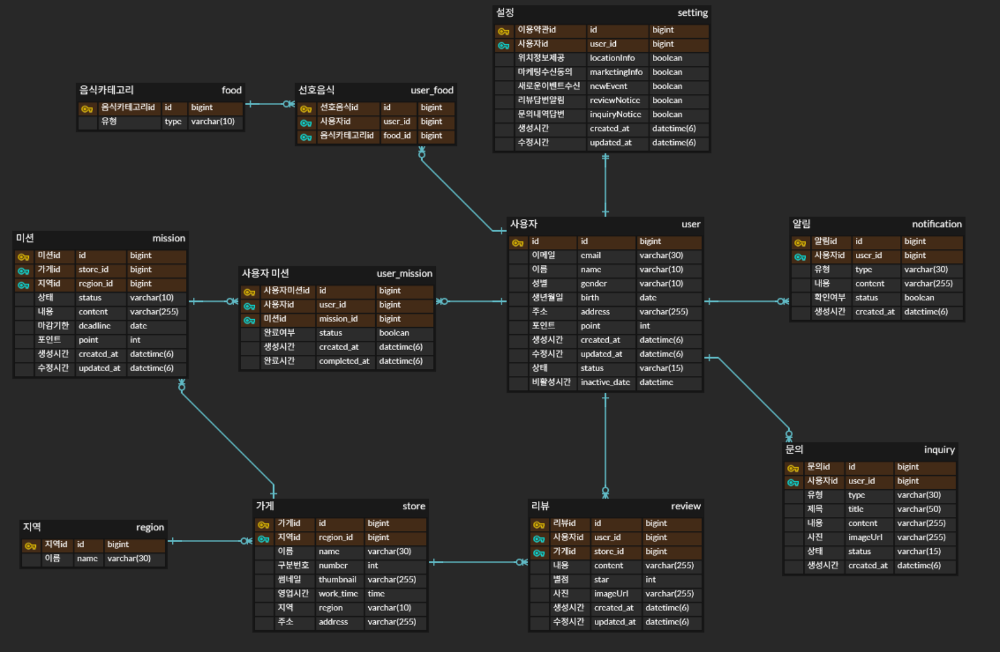

### 요구사항

사용자 관련 요구사항

- 회원가입 시 사용자 이름, 성별, 생년월일, 주소, 선호 음식 정보 필요
- 약관 동의 내역 테이블 필요
- 선호 음식 카테고리 선택 기능 필요(다중 선택 가능)
- 소셜 로그인 기능 필요
- 회원 탈퇴 기능 필요

지역 관련 요구사항

- 지역별 가게 분류

가게 관련 요구사항

- 가게 id, 카테고리, 이름, 점포번호, 지역, 주소, 썸네일 등

미션 관련 요구사항

- 특정 가게에 대해 수행해야 할 미션 표시(상태, 마감기한, 포인트 등)
- 지역당 10개 미션 완료 시 1000포인트 지급

리뷰 관련 요구사항

- 특정 가게에 대해 작성한 리뷰(별점, 내용, 사진, 답글)

1:1 문의 관련 요구사항

- 사용자가 문의사항을 작성할 수 있다. (문의 제목, 문의 유형, 문의 내용, 문의 사진, 작성 시간, 처리 상태)

알림 관련 요구사항

- 사용자별 알림 내역(알림 유형, 알림 내용, 확인 여부)
- 알림 설정(새로운 이벤트 수신, 리뷰 답변 알림, 문의 내역 답변 알림)

### ERD

