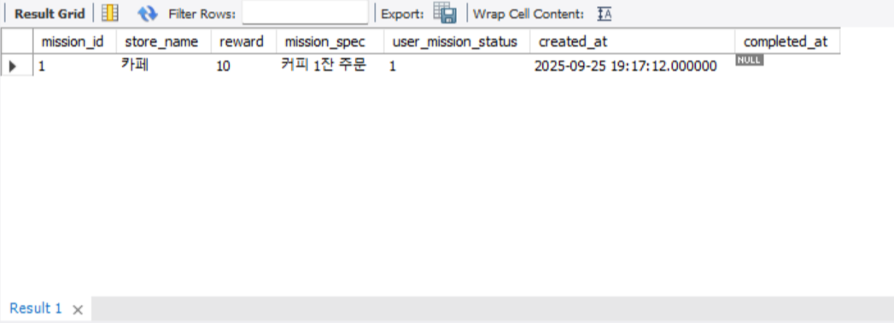
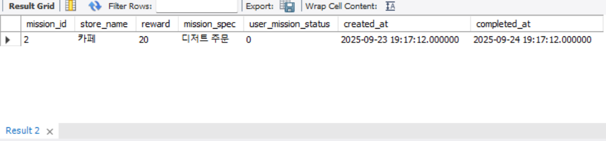
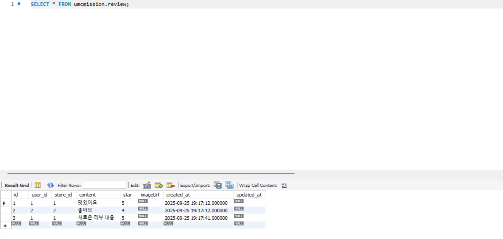
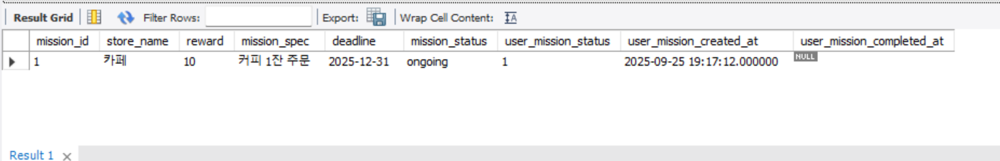
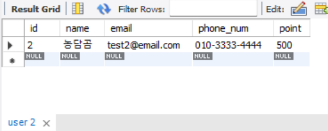

# 미션 기록

**1주차 erd 수정**

- mission 테이블 region_id 제거
- user 테이블 phone_num 추가

**erd 기반으로 mysql에서 테이블 생성 후 실제값을 넣어서 결과 확인**

**테스트용 데이터 insert**

```sql
-- region
INSERT INTO region (id, name) VALUES 
(1, '서울'), (2, '부산');

-- store
INSERT INTO store (id, region_id, name, number, thumbnail, work_time, region, address)
VALUES 
(1, 1, '카페', 123456, NULL, '09:00:00', '강남', '서울 강남구 123'),
(2, 2, '식당', 789012, NULL, '10:00:00', '해운대', '부산 해운대구 456');

-- user
INSERT INTO user (id, email, name, gender, birth, address, point, created_at, updated_at, status, inactive_date, phone_num) VALUES
(1, 'test1@email.com', '김이박', '남', '1990-01-01', '서울시 강남구', 1000, NOW(), NOW(), 'active', NULL, '010-1111-2222'),
(2, 'test2@email.com', '농담곰', '여', '1995-05-05', '부산시 해운대구', 500, NOW(), NOW(), 'active', NULL, '010-3333-4444');

-- mission
INSERT INTO mission (id, store_id, status, content, deadline, point, created_at)
VALUES 
(1, 1, 'ongoing', '커피 1잔 주문', '2025-12-31', 10, NOW()),
(2, 1, 'ongoing', '디저트 주문', '2025-12-31', 20, NOW()),
(3, 2, 'ongoing', '점심 식사', '2025-12-31', 15, NOW());

-- user_mission
INSERT INTO user_mission (id, user_id, mission_id, status, created_at, completed_at) VALUES
(1, 1, 1, TRUE, NOW(), NULL),   -- 진행중
(2, 1, 2, FALSE, NOW() - INTERVAL 2 DAY, NOW() - INTERVAL 1 DAY); -- 완료

-- review
INSERT INTO review (id, user_id, store_id, content, star, created_at)
VALUES
(1, 1, 1, '맛있어요', 5, NOW()),
(2, 2, 2, '좋아요', 4, NOW());
```

### 내가 진행중, 진행 완료한 미션 모아서 보는 쿼리(페이징 포함)

```sql
SELECT 
    m.id AS mission_id,
    s.name AS store_name,
    m.point AS reward,           -- mission.point
    m.content AS mission_spec,   -- mission.content
    um.status AS user_mission_status, -- TRUE(진행중)/FALSE(진행완료)
    um.created_at,
    um.completed_at
FROM user u
JOIN user_mission um ON u.id = um.user_id
JOIN mission m ON m.id = um.mission_id
JOIN store s ON m.store_id = s.id
WHERE u.id = {user_id}                      -- 특정 사용자 ID
  AND um.status = TRUE            -- Boolean 상태값
  AND m.id < {cursor_value}       -- 커서
ORDER BY m.id DESC
LIMIT 10;
```


status TRUE(진행 중), user_id = 1, cursor_value: 5로 돌린 결과



status FALSE(진행 완료), user_id = 1, cursor_value: 5로 돌린 결과


### 리뷰 작성하는 쿼리(사진의 경우는 일단 배제)

```sql
INSERT INTO review (id, user_id, store_id, content, star, created_at)
VALUES ({review_id}, {user_id}, {store_id}, '{content}', {star}, NOW());
```


id = 3, user_id = 1, store_id = 1, … 로 돌린 결과


### 홈 화면 쿼리(현재 선택 된 지역에서 도전이 가능한 미션 목록, 페이징 포함)

```sql
SELECT 
    m.id                AS mission_id,
    s.name              AS store_name,
    m.point             AS reward,
    m.content           AS mission_spec,
    m.deadline,
    m.status            AS mission_status,
    um.status           AS user_mission_status,  -- NULL = 아직 도전 안함, TRUE/FALSE = 진행중/완료
    um.created_at       AS user_mission_created_at,
    um.completed_at     AS user_mission_completed_at
FROM mission m
JOIN store s ON m.store_id = s.id
LEFT JOIN user_mission um 
       ON m.id = um.mission_id 
      AND um.user_id = {user_id}           -- 특정 사용자
WHERE s.region_id = {region_id}             -- 선택한 지역
  AND (um.status IS NULL OR um.status = TRUE)  -- 아직 도전 안했거나 진행중
  AND m.id < {cursor_value}                 -- 첫 페이지 조회용 커서
ORDER BY m.id DESC
LIMIT 10;
```


user_id = 1, region_id = 1로 돌린 결과


### 마이 페이지 화면 쿼리

```sql
SELECT 
    id,
    name,
    email,
    phone_num,
    point
FROM user
WHERE id = {user_id};
```


user_id 2로 돌린 결과
