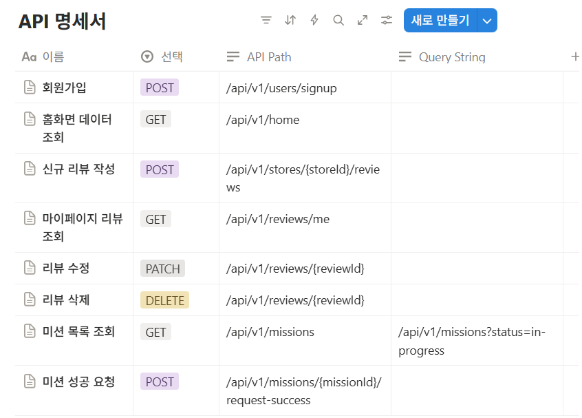

1. 회원가입
## **Request Header**

```json
Content-Type: application/json
```

## Request Body

```json
 "email": "user@example.com",
  "password": "123456!",
  "name": "박서윤",
  "gender": "FEMALE",
  "birthdate": "2003-06-02",
  "address": "서울특별시 노원구",
  "preferredFoods": ["한식", "중식", "일식"]
```

## Response

```json
// 성공
{
  "success": true,
  "code": "S201",
  "message": "회원가입이 완료되었습니다.",
  "data": {
    "userId": 1,
    "name": "박서윤",
    "accessToken": "...."
  }
}
```

```json
// 실패(400 Bad Request)
{
  "success": false,
  "code": "E4001",
  "message": "이미 존재하는 이메일입니다.",
  "data": null
}
```

2. 홈화면 데이터 조회
## **Request Header**

```json
Authorization: Bearer {accessToken}
```

## Request Body

```json
 // 없음
```

## Response

```sql
// 성공
{
  "success": true,
  "code": "S200",
  "message": "홈 화면 정보 조회가 완료되었습니다.",
  "data": {
    "nickname": "노원구떵개",
    "points": 500,
    "missionProgress": { "currentCount": 7, "totalCount": 10 },
    "myMissions": [
      {
        "missionId": 12,
        "storeName": "반이학생마라탕",
        "condition": "10,000원 이상의 식사시",
        "reward": 500,
        "dDay": 7
      }
    ]
  }
}
```

```json
// 실패(401 Unauthorized)
{
  "success": false,
  "code": "E4010",
  "message": "인증에 실패하였습니다. 유효한 토큰이 필요합니다.",
  "data": null
}
```

3. 신규 리뷰 작성
※ Path Variable → storeId : 리뷰를 작성할 가게의 고유 id

## **Request Header**

```json
Authorization: Bearer {accessToken}
Content-Type: application/json
```

## Request Body

```json
{
  "rating": 4.5,
  "content": "미션 덕분에 와봤는데 정말 맛있네요!"
}
```

## Response

```sql
// 성공(201 Created)
{
  "success": true,
  "code": "S201",
  "message": "리뷰가 성공적으로 등록되었습니다.",
  "data": { "reviewId": 101, "storeId": 25, "rating": 4.5, ... }
}
```

```json
// 실패(409 Conflict)
{
  "success": false,
  "code": "E4090",
  "message": "이미 해당 가게에 대한 리뷰를 작성했습니다.",
  "data": null
}
```
4. 마이페이지 리뷰 조회
## **Request Header**

```json
Authorization: Bearer {accessToken}
```

## Request Body

```json
{
  "rating": 4.5,
  "content": "미션 덕분에 와봤는데 정말 맛있네요!"
}
```

## Response

```sql
// 성공(200 ok)
{
  "success": true,
  "code": "S200",
  "message": "작성한 리뷰 목록 조회가 완료되었습니다.",
  "data": [
    { "reviewId": 101, "storeName": "반이학생마라탕", ... }
  ]
} 
```

5. 리뷰 수정
※ Path Variable → reviewId : 리뷰 고유 id

## **Request Header**

```json
Authorization: Bearer {accessToken}
Content-Type: application/json
```

## Request Body

```json
{
  "rating": 4.0,
  "content": "내용 수정"
}
```

## Response

```sql
// 성공
{
  "success": true,
  "code": "S200",
  "message": "리뷰가 성공적으로 수정되었습니다.",
  "data": { "reviewId": 101, "rating": 4.0, ... }
}
```
6. 리뷰 삭제
※ Path Variable → reviewId : 삭제할 리뷰 고유 id

## **Request Header**

```json
Authorization: Bearer {accessToken}
```

## Request Body

```json
// 없음
```

## Response

```sql
// 성공
{
  "success": true,
  "code": "S200",
  "message": "리뷰가 성공적으로 삭제되었습니다.",
  "data": { "reviewId": 101 }
}
```

7. 미션 목록 조회
## **Request Header**

```json
Authorization: Bearer {accessToken}
```

## Request Body

```json
// 없음
```

## Response

```sql
 // 성공(200 ok)
 {
  "success": true,
  "code": "S200",
  "message": "미션 목록 조회가 완료되었습니다.",
  "data": [
    {
      "missionId": 12,
      "storeName": "반이학생마라탕",
      "condition": "10,000원 이상의 식사시",
      "reward": 500,
      "status": "IN_PROGRESS"
    }
  ]/
```

```json
// 실패(400 Bad Request) status 값이 잘못됐을때
JSON

{
  "success": false,
  "code": "E4003",
  "message": "잘못된 미션 상태입니다. 'in-progress' 또는 'completed'를 사용해주세요.",
  "data": null
}

```

QueryString:

status(String): 미션 상태 필터링(in-progress/ completed)

/api/v1/missions?status=in-progress


8. 미션 성공 요청
※ Path Variable → missionId 성공 미션 고유 id

## **Request Header**

```json
Authorization: Bearer {accessToken}
```

## Request Body

```json
// 없음
```

## Response

```sql
// 성공(200 ok)
 {
  "success": true,
  "code": "S200",
  "message": "미션 성공 요청이 완료되었습니다.",
  "data": {
    "authCode": "920394810"
  }
}
```

```json
// 실패(404)
{
  "success": false,
  "code": "E4040",
  "message": "해당 미션을 찾을 수 없습니다.",
  "data": null
}
```